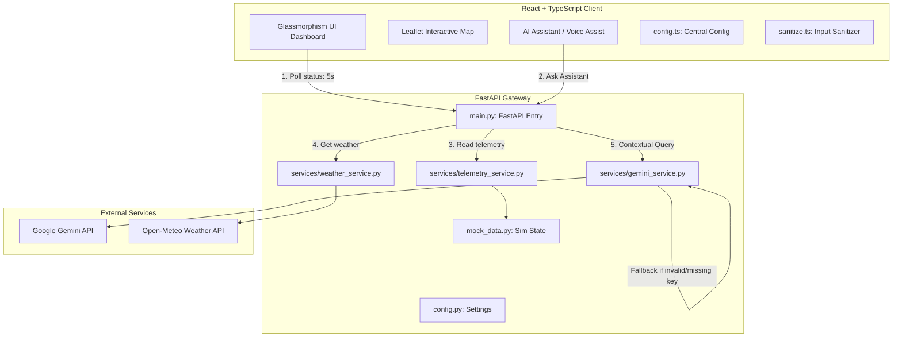
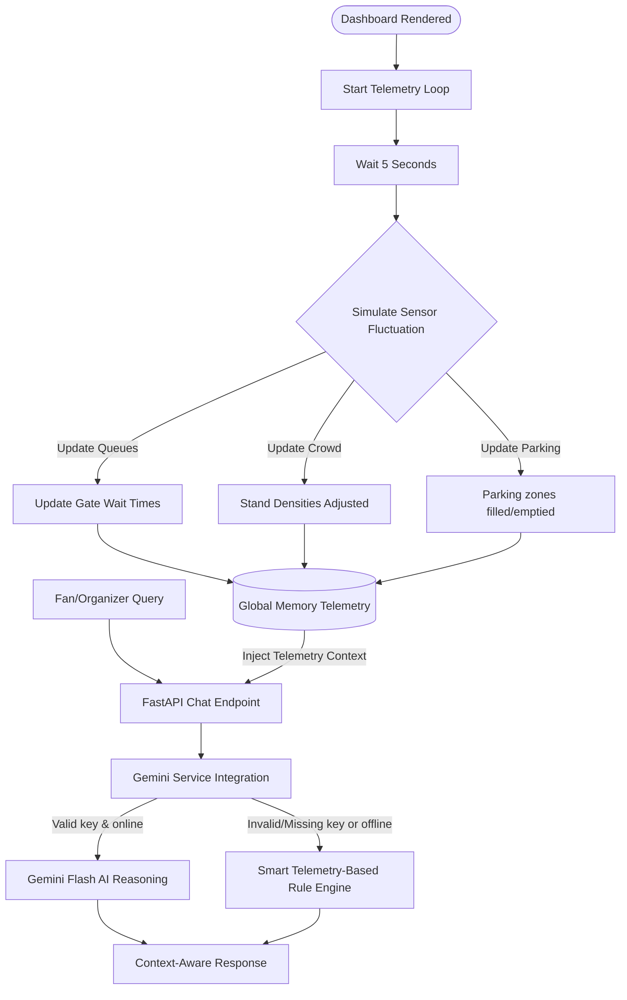

# FIFA MatchMate AI ⚽🏆
### *Smart Stadium Orchestrator for the FIFA World Cup 2026*

**FIFA MatchMate AI** is a production-ready, full-stack stadium assistant and organizer control dashboard. It provides real-time crowd dynamics, automated transit advisories, accessibility support, and safety management, powered by **FastAPI**, **React + Vite**, and **Google Gemini AI**.

This project features a fully refactored, robust, modular software engineering architecture, secure input validation/sanitization, strict WCAG accessibility patterns, and a comprehensive test coverage suite for both frontend and backend.

---

## 📸 Dashboard Preview

### Fan Dashboard


### Organizer Dashboard


## 🏗️ Architecture & Interaction Flow



### Operations Lifecycle Flowchart



---

## 🌟 Key Features

### 🧑‍💻 Fan Dashboard
- **AI Chat & Voice Assistant**: Interactive conversational panel using **Web Speech API** for Text-to-Speech (TTS) and Speech-to-Text (STT) queries, allowing users to ask about stadium logistics.
- **Smart Navigation Map**: Interactive Leaflet maps showing stadium layouts, gate status, concessions, restrooms, medical tents, and lost items.
- **Transport Hub Feed**: Real-time metro departure schedules, active bus shuttle counts, and rideshare latency indicators.
- **Multi-Services Directory**: Collapsible directories detailing Concourse BBQ & concessions wait times, restrooms occupancy, first aid status, and ADA accessibility guides.
- **Volunteer Assist**: Integrated form allowing fans to directly request volunteer aid by submitting their seat location and request description.
- **Multilingual localization**: Dynamic on-the-fly toggles between English, Español, and Français translating dashboard headers.

### 🛡️ Organizer Dashboard
- **Crowd Heatmap & Traffic**: Clear color-coded alerts on North, South, East, and West stands occupancy ratios.
- **Gate Wait Time Bar Chart**: Dynamic custom SVG bar charts showing queue lengths in real-time.
- **Volunteer Reallocator**: Transfer active volunteer groups between stadium stands with a single click to manage sudden bottlenecks.
- **Emergency notice board**: Instantly broadcast critical safety instructions which broadcast a flashing banner onto the Fan Dashboard immediately.
- **Gemini Operational Audit**: Run automated AI-driven logistics reviews outlining stand capacities and suggesting operational reallocations.
- **Sustainability scoreboard**: Tracking live indicators of green energy generated (kWh), carbon offsets (kg), water conserved (liters), and waste recycled.

---

## 📁 Repository Structure

```
FIFA PROJECT/
├── backend/
│   ├── main.py            # FastAPI Entry point, CORS settings & route controllers
│   ├── config.py          # Centralized configuration & environment loader
│   ├── mock_data.py       # Stadium telemetry simulator state
│   ├── gemini.py          # Backward-compatible wrapper pointing to gemini_service
│   ├── services/
│   │   ├── gemini_service.py    # Google Gemini client + Smart Telemetry Fallback Engine
│   │   ├── telemetry_service.py # Live data updater, mutations, and sanitization
│   │   └── weather_service.py   # Open-Meteo proxy, caching, and mapping
│   ├── test_main.py       # Pytest unit & integration test suite
│   └── requirements.txt   # Python server requirements
├── frontend/
│   ├── src/
│   │   ├── components/
│   │   │   ├── Sidebar.tsx            # Left side branding & selector controls
│   │   │   ├── WeatherWidget.tsx      # Open-Meteo weather card
│   │   │   ├── MockMap.tsx            # Leaflet map setup & marker layers
│   │   │   ├── AIChatVoice.tsx        # Voice assistant & Gemini Chat UI
│   │   │   ├── FanDashboard.tsx       # Assembled Fan Collapsible Widgets
│   │   │   ├── OrganizerDashboard.tsx # Assembled Organizer Widgets & SVGs
│   │   │   ├── fan/                   # Modularized Fan Dashboard panels
│   │   │   │   ├── TransitPanel.tsx
│   │   │   │   ├── ParkingPanel.tsx
│   │   │   │   ├── DiningPanel.tsx
│   │   │   │   ├── WashroomsPanel.tsx
│   │   │   │   ├── MedicalPanel.tsx
│   │   │   │   ├── AccessibilityPanel.tsx
│   │   │   │   ├── VolunteerPanel.tsx
│   │   │   │   ├── LostFoundPanel.tsx
│   │   │   │   └── EmergencyPanel.tsx
│   │   │   └── organizer/             # Modularized Organizer Dashboard widgets
│   │   │       ├── TrafficDensityWidget.tsx
│   │   │       ├── GateWaitTimesChart.tsx
│   │   │       ├── EmergencyBroadcaster.tsx
│   │   │       ├── VolunteerStaffingWidget.tsx
│   │   │       └── SustainabilityMetricsWidget.tsx
│   │   ├── utils/
│   │   │   └── sanitize.ts            # Client-side input sanitization helpers
│   │   ├── config.ts                  # Centralized client configuration
│   │   ├── App.tsx                    # React state, header banners, 5-second polling loop
│   │   ├── main.tsx                   # React root mounting
│   │   ├── api.ts                     # Fetch services communicating with FastAPI
│   │   ├── types.ts                   # TypeScript interfaces matching backend models
│   │   └── setupTests.ts              # Vitest mock setups
│   ├── package.json       # React, Tailwind, Lucide, Leaflet, and Vitest deps
│   ├── tailwind.config.js # Custom theme configurations and animations
│   ├── tsconfig.json      # TypeScript compiler specifications
│   └── index.html         # Google Fonts (Outfit) & Leaflet styles link
├── .env.example           # Example environment variables (No exposed keys)
├── .env                   # Active environment variables (Loaded securely)
├── .gitignore             # Standard gitignore configurations
└── README.md              # Project documentation
```

---

## 🔒 Security Practices

1. **Environment Variables Protection**: Sensitive configuration variables (like the `GEMINI_API_KEY`) are loaded dynamically from the local `.env` and are never hardcoded in any script, config, or documentation.
2. **CORS Restrictions**: Configured CORS origins using a predefined trustlist (`localhost` & `127.0.0.1` origins) inside [config.py](file:///d:/FIFA%20PROJECT/backend/config.py).
3. **Input Sanitization**: Both frontend ([sanitize.ts](file:///d:/FIFA%20PROJECT/frontend/src/utils/sanitize.ts)) and backend ([telemetry_service.py](file:///d:/FIFA%20PROJECT/backend/services/telemetry_service.py)) utilize sanitizers to strip HTML/script tags from user inputs, protecting the dashboards from XSS injections.
4. **Secure Error Boundaries**: FastAPI endpoint handlers are protected by global exception middlewares. Any runtime error is logged internally, returning a sanitized generic `500 Internal Server Error` instead of raw tracebacks to the client.
5. **Pydantic Validation**: All POST bodies are parsed and validated strictly using Pydantic fields and `@field_validator` assertions (preventing empty fields, invalid roles, or improper severity tags).

---

## ♿ Accessibility Compliance

The application adheres to WCAG best practices:
- **Semantic HTML**: Refactored dashboard panels use standard landmark elements (`<main>`, `<aside>`, `<section>`, `<header>`, `<footer>`).
- **Keyboard Usability**: Every interactive widget, selector, and accordion supports keyboard focus styling and can be toggled using `Enter` or `Space` keys via custom `onKeyDown` handlers.
- **ARIA Integration**: Dynamic state parameters (`aria-expanded`, `aria-controls`, `aria-labelledby`, `role="button"`) are integrated on all collapsible accordion structures.
- **Screen Reader Compatibility**: Labels (`aria-label`, `<label htmlFor="...">`) are attached to all select fields, form textareas, inputs, and toggle buttons.

---

## 🚀 Setup & Execution

### 1. Environment Variables Configuration
In the root directory, create a `.env` file (copied from `.env.example`).
```ini
GEMINI_API_KEY=YOUR_GEMINI_API_KEY
PORT=8001
VITE_API_URL=http://localhost:8000
```

### 2. Run the Backend (FastAPI)
Navigate to the `backend/` directory, set up a Python virtual environment, install requirements, and start the development server:

```powershell
cd backend
python -m venv venv
# On Windows PowerShell:
.\venv\Scripts\Activate.ps1
# On Linux/macOS:
source venv/bin/activate

pip install -r requirements.txt
python -m uvicorn main:app --reload --port 8000
```
*The FastAPI backend will run on [http://localhost:8001](http://localhost:8000).*

### 3. Run the Frontend (React + Vite)
Open a new terminal window, navigate to the `frontend/` directory, install packages, and start Vite:

```powershell
cd frontend
npm install
npm run dev
```
*The React application will run on [http://localhost:5173](http://localhost:5173) and route API queries to the backend automatically via Vite proxy.*

---

## 🧪 Testing Guidelines

### Run Backend Unit Tests (Pytest)
With the python virtual environment activated inside the `backend/` directory, run:
```bash
pytest -v
```
*The test suite includes dedicated test cases for input validation failures, network timeouts, invalid API keys, missing API keys, empty telemetry objects, and rule-based fallback response validations.*

### Run Frontend Unit Tests (Vitest)
Navigate to the `frontend/` directory and run:
```bash
npm run test
```
*The tests validate dashboard rendering, custom matchers, client-side input sanitization, keyboard triggers, ARIA landmarks, and accessibility expanders.*

---

## 🔮 Future Improvements

1. **Real telemetric integration**: Transition the current simulated telemetry background loops to active WebSocket connections pulling from AWS Iot Core or direct Kafka topics.
2. **Offline Local LLMs**: Embed lightweight, client-side WebAssembly LLMs (like ONNX Runtime Web or WebLLM) to perform the fallback operations in-browser.
3. **Advanced GIS Layout**: Replace the mock Leaflet tiles with live 3D photorealistic layouts utilizing Three.js and Mapbox GL JS stadium blueprints.

   ---

## 👨‍💻 Author

**Abhishek** ❤️

Made with ❤️ for **Prompt Wars Virtual Challenge 4**

## 📄 License

This project is created for educational and hackathon purposes.
